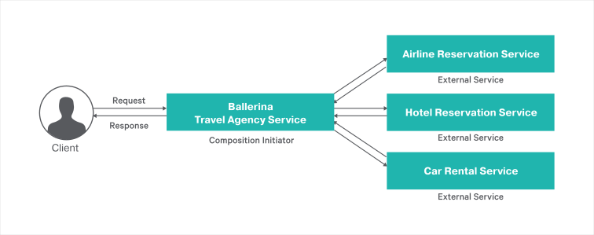

# Service Composition

A service composition is an aggregate of services collectively composed to automate a particular task or business process. To understand how you can build a service composition using Ballerina, let's consider a real-world use case of a Travel agency that arranges complete tours for users. A tour package includes airline ticket reservation, hotel room reservation and car rental. Therefore, the Travel agency service requires communicating with other necessary back-ends. The following diagram illustrates this use case clearly.



Travel agency is the service that acts as the composition initiator. The other three services are external services that the travel agency service calls to do airline ticket booking, hotel reservation and car rental. These are not necessarily Ballerina services and can theoretically be third-party services that the travel agency service calls to get things done. However, for the purposes of setting up this scenario and illustrating it in this guide, these third-party services are also written in Ballerina.

## Running the Sample
- Open a terminal at `service-composition/guide` and run `ballerina init`
- Open FOUR terminals at `service-composition/guide` and run FOUR commands in separate terminals to start all four HTTP services. This will start the `Airline Reservation`, `Hotel Reservation`, `Car Rental` and `Travel Agency` services in ports 9091, 9092, 9093 and 9090 respectively.

```bash
   $ ballerina run airline_reservation/
   $ ballerina run hotel_reservation/
   $ ballerina run car_rental/
   $ ballerina run travel_agency/
```
   
- Invoke the travel agency service by sending a POST request to arrange a tour.

```bash
   curl -v -X POST -d '{"Name":"Bob", "ArrivalDate":"12-03-2018",
   "DepartureDate":"13-04-2018", "Preference":{"Airline":"Business", 
   "Accommodation":"Air Conditioned", "Car":"Air Conditioned"}}' \
   "http://localhost:9090/travel/arrangeTour" -H "Content-Type:application/json"
```

  Travel agency service will send a response similar to the following:
    
```bash
   < HTTP/1.1 200 OK
   {"Message":"Congratulations! Your journey is ready!!"}
``` 
      
### Running unit tests 

To run the tests, open your terminal and navigate to `service-composition/guide`, and run the following command.
```bash
   $ ballerina test
```

To check the implementations of these test files, refer to the [airline_reservation_service_test.bal](https://github.com/ballerina-guides/service-composition/blob/master/guide/airline_reservation/tests/airline_reservation_service_test.bal), [hotel_reservation_service_test.bal](https://github.com/ballerina-guides/service-composition/blob/master/guide/hotel_reservation/tests/hotel_reservation_service_test.bal), [car_rental_service_test.bal](https://github.com/ballerina-guides/service-composition/blob/master/guide/car_rental/tests/car_rental_service_test.bal) and [travel_agency_service_test.bal](https://github.com/ballerina-guides/service-composition/blob/master/guide/tests/travel_agency_service_test.bal).

## Deploying on Docker

You can run the service that we developed above as a docker container. As Ballerina platform includes [Ballerina_Docker_Extension](https://github.com/ballerinax/docker), which offers native support for running ballerina programs on containers, you just need to put the corresponding docker annotations on your service code. 

Let's see how we can deploy the travel_agency_service we developed above on docker. When invoking this service make sure that the other three services (airline_reservation, hotel_reservation, and car_rental) are also up and running. 

- In our travel_agency_service, we need to import  `ballerinax/docker` and use the annotation `@docker:Config` as shown below to enable docker image generation during the build time. 

##### travel_agency_service.bal
```ballerina
import ballerina/http;
import ballerinax/docker;

@docker:Config {
    registry:"ballerina.guides.io",
    name:"travel_agency_service",
    tag:"v1.0"
}

@docker:Expose{}
endpoint http:Listener travelAgencyEP {
    port:9090
};

// http:Client endpoint definitions to communicate with other services

@http:ServiceConfig {basePath:"/travel"}
service<http:Service> travelAgencyService bind travelAgencyEP {
``` 

- Now you can build a Ballerina executable archive (.balx) of the service that we developed above, using the following command. This will also create the corresponding docker image using the docker annotations that you have configured above. Navigate to `service-composition/guide` and run the following command.  
  
```
   $ballerina build travel_agency
  
   Run following command to start docker container: 
   docker run -d -p 9090:9090 ballerina.guides.io/travel_agency_service:v1.0
```

- Once you successfully build the docker image, you can run it with the `` docker run`` command that is shown in the previous step.  

```bash
   $ docker run -d -p 9090:9090 ballerina.guides.io/travel_agency_service:v1.0
```

   Here we run the docker image with flag`` -p <host_port>:<container_port>`` so that we use the host port 9090 and the container port 9090. Therefore you can access the service through the host port. 

- Verify docker container is running with the use of `` $ docker ps``. The status of the docker container should be shown as 'Up'. 
- You can access the service using the same curl commands that we've used above. 
 
```bash
   curl -v -X POST -d '{"Name":"Bob", "ArrivalDate":"12-03-2018",
   "DepartureDate":"13-04-2018", "Preference":{"Airline":"Business", 
   "Accommodation":"Air Conditioned", "Car":"Air Conditioned"}}' \
   "http://localhost:9090/travel/arrangeTour" -H "Content-Type:application/json"
```


### Deploying on Kubernetes

- You can run the service that we developed above, on Kubernetes. The Ballerina language offers native support for running a ballerina programs on Kubernetes, with the use of Kubernetes annotations that you can include as part of your service code. Also, it will take care of the creation of the docker images. So you don't need to explicitly create docker images prior to deploying it on Kubernetes. Refer to [Ballerina_Kubernetes_Extension](https://github.com/ballerinax/kubernetes) for more details and samples on Kubernetes deployment with Ballerina. You can also find details on using Minikube to deploy Ballerina programs. 

- Let's now see how we can deploy our `travel_agency_service` on Kubernetes. When invoking this service make sure that the other three services (airline_reservation, hotel_reservation, and car_rental) are also up and running. 

- First we need to import `ballerinax/kubernetes` and use `@kubernetes` annotations as shown below to enable kubernetes deployment for the service we developed above. 

##### travel_agency_service.bal

```ballerina
import ballerina/http;
import ballerinax/kubernetes;

@kubernetes:Ingress {
  hostname:"ballerina.guides.io",
  name:"ballerina-guides-travel-agency-service",
  path:"/"
}

@kubernetes:Service {
  serviceType:"NodePort",
  name:"ballerina-guides-travel-agency-service"
}

@kubernetes:Deployment {
  image:"ballerina.guides.io/travel_agency_service:v1.0",
  name:"ballerina-guides-travel-agency-service"
}

endpoint http:Listener travelAgencyEP {
    port:9090
};

// http:Client endpoint definitions to communicate with other services

@http:ServiceConfig {basePath:"/travel"}
service<http:Service> travelAgencyService bind travelAgencyEP {    
``` 

- Here we have used ``  @kubernetes:Deployment `` to specify the docker image name which will be created as part of building this service. 
- We have also specified `` @kubernetes:Service `` so that it will create a Kubernetes service, which will expose the Ballerina service that is running on a Pod.  
- In addition we have used `` @kubernetes:Ingress ``, which is the external interface to access your service (with path `` /`` and host name ``ballerina.guides.io``)

- Now you can build a Ballerina executable archive (.balx) of the service that we developed above, using the following command. This will also create the corresponding docker image and the Kubernetes artifacts using the Kubernetes annotations that you have configured above.
  
```
   $ ballerina build travel_agency
  
   Run following command to deploy kubernetes artifacts:  
   kubectl apply -f ./target/travel_agency/kubernetes
```

- You can verify that the docker image that we specified in `` @kubernetes:Deployment `` is created, by using `` docker images ``. 
- Also the Kubernetes artifacts related our service, will be generated under `` ./target/travel_agency/kubernetes``. 
- Now you can create the Kubernetes deployment using:

```bash
   $ kubectl apply -f ./target/travel_agency/kubernetes 
 
   deployment.extensions "ballerina-guides-travel-agency-service" created
   ingress.extensions "ballerina-guides-travel-agency-service" created
   service "ballerina-guides-travel-agency-service" created
```

- You can verify Kubernetes deployment, service and ingress are running properly, by using following Kubernetes commands. 

```bash
   $ kubectl get service
   $ kubectl get deploy
   $ kubectl get pods
   $ kubectl get ingress
```

- If everything is successfully deployed, you can invoke the service either via Node port or ingress. 

Node Port:
```bash
   curl -v -X POST -d '{"Name":"Bob", "ArrivalDate":"12-03-2018",
   "DepartureDate":"13-04-2018", "Preference":{"Airline":"Business", 
   "Accommodation":"Air Conditioned", "Car":"Air Conditioned"}}' \
   "http://localhost:<Node_Port>/travel/arrangeTour" -H "Content-Type:application/json"  
```

Ingress:

Add `/etc/hosts` entry to match hostname. 
``` 
   127.0.0.1 ballerina.guides.io
```

Access the service 
```bash
   curl -v -X POST -d '{"Name":"Bob", "ArrivalDate":"12-03-2018",
   "DepartureDate":"13-04-2018", "Preference":{"Airline":"Business", 
   "Accommodation":"Air Conditioned", "Car":"Air Conditioned"}}' \
   "http://ballerina.guides.io/travel/arrangeTour" -H "Content-Type:application/json" 
```

## Observability 
Ballerina is by default observable. Meaning you can easily observe your services, resources, etc.
However, observability is disabled by default via configuration. Observability can be enabled by adding following configurations to `ballerina.conf` file in `service-composition/guide/`.

```ballerina
[b7a.observability]

[b7a.observability.metrics]
# Flag to enable Metrics
enabled=true

[b7a.observability.tracing]
# Flag to enable Tracing
enabled=true
```

NOTE: The above configuration is the minimum configuration needed to enable tracing and metrics. With these configurations default values are load as the other configuration parameters of metrics and tracing.

### Tracing 

You can monitor ballerina services using in built tracing capabilities of Ballerina. We'll use [Jaeger](https://github.com/jaegertracing/jaeger) as the distributed tracing system.
Follow the following steps to use tracing with Ballerina.

- You can add the following configurations for tracing. Note that these configurations are optional if you already have the basic configuration in `ballerina.conf` as described above.
```
   [b7a.observability]

   [b7a.observability.tracing]
   enabled=true
   name="jaeger"

   [b7a.observability.tracing.jaeger]
   reporter.hostname="localhost"
   reporter.port=5775
   sampler.param=1.0
   sampler.type="const"
   reporter.flush.interval.ms=2000
   reporter.log.spans=true
   reporter.max.buffer.spans=1000
```

- Run Jaeger docker image using the following command
```bash
   $ docker run -d -p5775:5775/udp -p6831:6831/udp -p6832:6832/udp -p5778:5778 \
   -p16686:16686 p14268:14268 jaegertracing/all-in-one:latest
```

- Navigate to `service-composition/guide` and run the `travel_agency_service` using following command 
```
   $ ballerina run travel_agency/
```

- Observe the tracing using Jaeger UI using following URL
```
   http://localhost:16686
```

### Metrics
Metrics and alerts are built-in with ballerina. We will use Prometheus as the monitoring tool.
Follow the below steps to set up Prometheus and view metrics for travel_agency service.

- You can add the following configurations for metrics. Note that these configurations are optional if you already have the basic configuration in `ballerina.conf` as described under `Observability` section.

```ballerina
   [b7a.observability.metrics]
   enabled=true
   provider="micrometer"

   [b7a.observability.metrics.micrometer]
   registry.name="prometheus"

   [b7a.observability.metrics.prometheus]
   port=9700
   hostname="0.0.0.0"
   descriptions=false
   step="PT1M"
```

- Create a file `prometheus.yml` inside `/tmp/` location. Add the below configurations to the `prometheus.yml` file.
```
   global:
     scrape_interval:     15s
     evaluation_interval: 15s

   scrape_configs:
     - job_name: prometheus
       static_configs:
         - targets: ['172.17.0.1:9797']
```

   NOTE : Replace `172.17.0.1` if your local docker IP differs from `172.17.0.1`
   
- Run the Prometheus docker image using the following command
```
   $ docker run -p 19090:9090 -v /tmp/prometheus.yml:/etc/prometheus/prometheus.yml \
   prom/prometheus
```
   
- You can access Prometheus at the following URL
```
   http://localhost:19090/
```

NOTE:  Ballerina will by default have following metrics for HTTP server connector. You can enter following expression in Prometheus UI
-  http_requests_total
-  http_response_time


### Logging

Ballerina has a log package for logging to the console. You can import ballerina/log package and start logging. The following section will describe how to search, analyze, and visualize logs in real time using Elastic Stack.

- Start the Ballerina Service with the following command from `service-composition/guide`
```
   $ nohup ballerina run travel_agency/ &>> ballerina.log&
```
   NOTE: This will write the console log to the `ballerina.log` file in the `service-composition/guide` directory

- Start Elasticsearch using the following command

- Start Elasticsearch using the following command
```
   $ docker run -p 9200:9200 -p 9300:9300 -it -h elasticsearch --name \
   elasticsearch docker.elastic.co/elasticsearch/elasticsearch:6.2.2 
```

   NOTE: Linux users might need to run `sudo sysctl -w vm.max_map_count=262144` to increase `vm.max_map_count` 
   
- Start Kibana plugin for data visualization with Elasticsearch
```
   $ docker run -p 5601:5601 -h kibana --name kibana --link \
   elasticsearch:elasticsearch docker.elastic.co/kibana/kibana:6.2.2     
```

- Configure logstash to format the ballerina logs

i) Create a file named `logstash.conf` with the following content
```
input {  
 beats{ 
     port => 5044 
 }  
}

filter {  
 grok{  
     match => { 
	 "message" => "%{TIMESTAMP_ISO8601:date}%{SPACE}%{WORD:logLevel}%{SPACE}
	 \[%{GREEDYDATA:package}\]%{SPACE}\-%{SPACE}%{GREEDYDATA:logMessage}"
     }  
 }  
}   

output {  
 elasticsearch{  
     hosts => "elasticsearch:9200"  
     index => "store"  
     document_type => "store_logs"  
 }  
}  
```

ii) Save the above `logstash.conf` inside a directory named as `{SAMPLE_ROOT}\pipeline`
     
iii) Start the logstash container, replace the {SAMPLE_ROOT} with your directory name
     
```
$ docker run -h logstash --name logstash --link elasticsearch:elasticsearch \
-it --rm -v ~/{SAMPLE_ROOT}/pipeline:/usr/share/logstash/pipeline/ \
-p 5044:5044 docker.elastic.co/logstash/logstash:6.2.2
```
  
 - Configure filebeat to ship the ballerina logs
    
i) Create a file named `filebeat.yml` with the following content
```
filebeat.prospectors:
- type: log
  paths:
    - /usr/share/filebeat/ballerina.log
output.logstash:
  hosts: ["logstash:5044"]  
```
NOTE : Modify the ownership of filebeat.yml file using `$chmod go-w filebeat.yml` 

ii) Save the above `filebeat.yml` inside a directory named as `{SAMPLE_ROOT}\filebeat`   
        
iii) Start the logstash container, replace the {SAMPLE_ROOT} with your directory name
     
```
$ docker run -v {SAMPLE_ROOT}/filbeat/filebeat.yml:/usr/share/filebeat/filebeat.yml \
-v {SAMPLE_ROOT}/guide/travel_agency/ballerina.log:/usr/share\
/filebeat/ballerina.log --link logstash:logstash docker.elastic.co/beats/filebeat:6.2.2
```
 
 - Access Kibana to visualize the logs using following URL
```
   http://localhost:5601 
```
  
